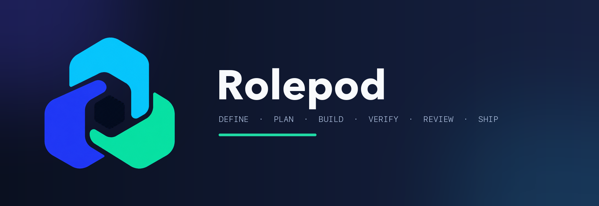

# Rolepod

**Rolepod turns Claude Code, Codex CLI, Cursor IDE, Antigravity CLI (agy), and opencode into a disciplined software-house team — a workflow router, 15 specialist agents, and gates that catch bugs before they reach a commit.**

It is one source of truth rendered into a native plugin for each CLI. No CLI is the "default" — all five are first-class. Rolepod carries zero project-specific configuration, so it works in any repository from the first session.

## What it helps with

- **Vague ideas → sharp specs.** A half-stated feature request becomes an agreed spec before any code is written.
- **Multi-file work → a real plan.** Tasks, agent ownership, and a cohesion contract so parallel work doesn't collide.
- **Test-first builds.** RED → GREEN discipline instead of tests bolted on afterward.
- **Bugs caught at commit time.** Scope creep, single-use abstractions, weak assertions, and missing tests are flagged before they land — not in review.
- **The right specialist on the job.** Frontend, security, performance, billing, docs — domain work routes to a specialist agent instead of one generalist guessing.

## How it works

Rolepod starts the moment you give your CLI a task — you don't run a command or pick a mode. A router skill reads the request and places it in the workflow: a one-line typo fix goes straight to the edit; a vague "build me X" gets pulled back into a spec conversation first.

Every real change then moves through six phases:

```
Define → Plan → Build → Verify → Review → Ship
```

Each phase has one skill that runs it, and each skill pulls in specialist agents when the work needs depth. A commit that follows the workflow passes silently; on Claude, a high-risk diff (auth, billing, migrations and similar paths) is blocked until a `security-engineer` review has run.

You invoke nothing for this; it just happens.

## The workflow

1. **Define — `write-spec`.** Turns a fuzzy request into a spec, shown back in chunks short enough to actually read and approve.
2. **Plan — `write-plan`.** Breaks the spec into tasks, assigns agent ownership, writes a cohesion contract before any parallel work.
3. **Build — `implement-plan`.** Executes the plan test-first with bounded delegation. Bug fixes take the `debug-issue` path: reproduce → failing test → minimal fix.
4. **Verify — `check-work`.** Proves the change with evidence — tests, build, curl, a screenshot — never just a "done".
5. **Review — `review-code`.** Every logic diff gets two lenses (spec compliance + standards); an R4 (high-risk) diff adds `security-engineer` (Standard and Full) and, in Full, one adversarial pass (`adversarial-review`).
6. **Ship — `finish-work`.** One pre-merge gate, CI lanes, and a 3-option finish menu (merge, PR, keep open; discard only when you ask).

Two skills run across phases: **`simplify-code`** (behavior-preserving cleanup) and **`manage-context`** (recovery when a session is long, stuck, or in an unfamiliar repo).

Every request is tiered before the first edit, and the tier sets how much of the workflow runs. The routing line always carries the tier with its meaning — `Route: R2 (one file + test) → implement-plan · reason` — so nobody has to look the code up:

| Tier | Meaning | What runs |
|---|---|---|
| **R0** | answer only — no file changes | reply directly |
| **R1** | trivial edit — ≤5 lines, one file, no logic | edit; the tool's echo is the proof |
| **R2** | one file + its test, a small logic change | inline checklist → build → verify → one read-only reviewer pass |
| **R3** | multi-file, vague scope, or needs sequencing | the full six-phase spine |
| **R4** | high-risk path (auth, billing, migrations, secrets…) | full spine + adversarial review floor, never downgraded |

## Works with Claude Code Ultracode

Rolepod composes with Claude Code's **Ultracode** mode out of the box — no setup. Ultracode is the harness orchestration layer (parallel multi-agent workflows, adversarial verification); Rolepod is the structure it runs — phases, specialist agents, cohesion contracts, and gates. Ultracode supplies the horsepower; Rolepod keeps it targeted and safe. The two principles are orthogonal, not opposed: Rolepod's *simplest-viable* governs the solution, Ultracode's *exhaustiveness* governs the process — so an exhaustive run still converges on a simple result. Effort governs how hard each stage thinks; the rigor tier governs how many stages there are — an R1/R2 change stays one review pass even under Ultracode, because an effort setting never lifts the tier.

## Install

Pick your CLI. Rolepod installs **only itself** — agents, skills, hooks, manifests. No third-party tools are installed for you.

### Claude Code

```bash
# Install
claude plugin marketplace add nuttaruj/rolepod
claude plugin install rolepod@rolepod

# Update
claude plugin marketplace update rolepod
claude plugin update rolepod@rolepod

# Uninstall
curl -fsSL https://raw.githubusercontent.com/nuttaruj/rolepod/main/bootstrap.sh | bash -s -- --uninstall --target=claude
```

#### Claude Code cloud sessions (claude.ai/code)

A cloud session loads none of your local plugins, none synced from your claude.ai account, and none a repo enables in `.claude/settings.json`; a plugin folder committed under `.claude/skills/` is skipped as untrusted. Install rolepod from the cloud environment's **Setup script** instead — it runs before Claude Code starts, so hooks, agents and skills all load. One environment covers every repo that uses it, and your local install is untouched.

In claude.ai/code → **Add cloud environment** (or edit one):

- **Network access:** Trusted (it already allows github.com)
- **Environment variables:** `CLAUDE_CODE_PLUGIN_PREFER_HTTPS=1`
- **Setup script:**

```bash
#!/bin/bash
# rolepod — edit this line to force a cache rebuild (pull the latest release now)
claude plugin marketplace add nuttaruj/rolepod || true
claude plugin marketplace update rolepod || true
claude plugin install rolepod@rolepod || true
claude plugin update rolepod@rolepod || true
claude plugin list || true
```

Save it once; it stays. Each new session got the latest release without editing the script (observed 2026-10-01; the docs describe a cache rebuilt about every 7 days). A session already running keeps its version — start a new one after a release. If a new session still shows the old version, edit the comment line to force a rebuild. Check it worked: in a new session, `claude plugin list` shows `rolepod@rolepod`. Cross-family members (codex, agy, cursor, opencode) are not on the cloud VM, so `cross-family` stays off there.

### Codex CLI

```bash
# Install — the plugin carries skills + hooks + the 15 agents; on first launch a SessionStart
# hook syncs the agents + the AGENTS.md block into ~/.codex (run /hooks once in Codex to trust them).
# The bootstrap line stays the full path: project-scope AGENTS.md, doctor, uninstall.
codex plugin marketplace add nuttaruj/rolepod
codex plugin add rolepod@rolepod
curl -fsSL https://raw.githubusercontent.com/nuttaruj/rolepod/main/bootstrap.sh | bash -s -- --target=codex

# Update — agents + the AGENTS.md block follow on the next Codex launch (v2.75.0).
# Codex trusts hooks by hash: the first time a rolepod hook is new or changed, run /hooks
# once inside Codex and trust it — until then Codex skips it (official hook-trust rule).
codex plugin marketplace upgrade rolepod
codex plugin remove rolepod@rolepod && codex plugin add rolepod@rolepod

# Uninstall
curl -fsSL https://raw.githubusercontent.com/nuttaruj/rolepod/main/bootstrap.sh | bash -s -- --uninstall --target=codex
```

Codex hooks fire natively on Codex ≥0.144 — no opt-in needed (the legacy `plugin_hooks` flag was removed upstream). Agents, skills, and the `AGENTS.md` always-on core load independently of hooks.

> Gemini CLI — removed in v2.177.0; Google moved consumers to Antigravity (`agy`) — use `--target=antigravity`.

### Cursor IDE

**Install via `bootstrap.sh`** — copies the plugin tree to `~/.cursor/plugins/local/rolepod/`:

```bash
# Install
curl -fsSL https://raw.githubusercontent.com/nuttaruj/rolepod/main/bootstrap.sh | bash -s -- --target=cursor

# Update — re-run with --force
curl -fsSL https://raw.githubusercontent.com/nuttaruj/rolepod/main/bootstrap.sh | bash -s -- --target=cursor --force

# Uninstall
curl -fsSL https://raw.githubusercontent.com/nuttaruj/rolepod/main/bootstrap.sh | bash -s -- --uninstall --target=cursor
```

Restart Cursor (or reload the window) so the plugin registers. Verify under **Cursor → Settings → Plugins**.

The always-on judgment core ships as an `alwaysApply: true` rule (`rules/always-on-core.mdc`) — loaded automatically on every Cursor session. Disabling **Settings → Features → Rules** suppresses it.

**Or install from the marketplace** with Cursor's `agent` CLI. Cursor pins a user marketplace to the commit it indexed at `add` time; `agent plugin marketplace update` re-indexes but keeps that commit, so moving to a newer release is remove + add (the remove also drops the installed marketplace plugin — install it again; a rolepod still listed afterwards is the local `install.sh` copy or the Claude Code import, not the marketplace one):

```bash
# Install — then install "rolepod" from /plugins (agent CLI) or Settings → Plugins
agent plugin marketplace add https://github.com/nuttaruj/rolepod

# Update
agent plugin marketplace remove rolepod
agent plugin marketplace add https://github.com/nuttaruj/rolepod

# Which commit is pinned
agent plugin marketplace list --format json
```

The marketplace install is the account-side copy — the one Cursor's cloud agents get; the `bootstrap.sh` folder exists on that machine only. With both installed, the marketplace plugin takes precedence over the local copy of the same name, so a stale pin hides a fresh `bootstrap.sh` install: update the marketplace pin on every release.

> **Teams / Enterprise plans** can alternatively add `https://github.com/nuttaruj/rolepod` as a team marketplace under Settings → Plugins for one-click install; a team marketplace has an **Enable Auto Refresh** switch that follows the tracked branch. Team Marketplaces are not available on Free / Pro plans.

### Antigravity CLI (agy) — Beta

Google moved Gemini's consumer tiers (free / AI Pro / Ultra) to Antigravity CLI on 2026-06-18; this adapter installs rolepod as a native agy plugin (`agy plugin install`).

```bash
# Install
curl -fsSL https://raw.githubusercontent.com/nuttaruj/rolepod/main/bootstrap.sh | bash -s -- --target=antigravity

# Update — re-run with --force
curl -fsSL https://raw.githubusercontent.com/nuttaruj/rolepod/main/bootstrap.sh | bash -s -- --target=antigravity --force

# Uninstall
curl -fsSL https://raw.githubusercontent.com/nuttaruj/rolepod/main/bootstrap.sh | bash -s -- --uninstall --target=antigravity
```

### opencode

Installs skills + agents natively into `~/.config/opencode/`, a JS plugin
(session locks, post-compact re-anchor, mode-aware child ship gate and Lead
precommit conditions), and an `AGENTS.md` managed block. opencode 2 loads
plugins when its shared service boots: run `opencode service restart` after
every install or update. Native read-only agent permissions remain separate
from Rolepod workflow gates. Plugin gate behavior is fixture-verified; see
[docs/cli-support.md](docs/cli-support.md) for the current runtime limits.

```bash
# Install
curl -fsSL https://raw.githubusercontent.com/nuttaruj/rolepod/main/bootstrap.sh | bash -s -- --target=opencode

# Update — re-run with --force
curl -fsSL https://raw.githubusercontent.com/nuttaruj/rolepod/main/bootstrap.sh | bash -s -- --target=opencode --force

# Uninstall
curl -fsSL https://raw.githubusercontent.com/nuttaruj/rolepod/main/bootstrap.sh | bash -s -- --uninstall --target=opencode
```

**Install all five at once** with `--target=all`. **One repo only, no global config:** add `--scope=project`. Restart the CLI after installing (opencode 2: `opencode service restart`). Full per-CLI matrix and install scopes: [docs/cli-support.md](docs/cli-support.md).

## Config

Workflow settings live in `~/.rolepod/config.json`; a project's
`.rolepod/config.json` can override its `workflow.mode`. The independent
`pool` setting remains global-only.

**Location:** `~/.rolepod/config.json`. `install.sh` (every flag, `--force`
included) and first session initialization write it only when it is missing,
unreadable, or in the old format (a top-level `review`, `gates` or `nudge` key,
or no `workflow.mode`). The new file has `workflow.mode=lite` and keeps your
existing `pool`; no backup is made. A valid config is never touched, so
`--force` keeps an explicit Standard or Full profile. Native plugin
uninstall/reinstall leaves it alone too, and uninstall never removes the file.

**Example:**

```json
{
  "version": 1,
  "workflow": { "mode": "lite" },
  "pool": {
    "cross-family": "on",
    "reviewer": { "review": "opencode cursor agy codex claude", "consult": "opencode codex cursor agy claude", "critique": "opencode cursor agy codex claude" }
  }
}
```

**Settings:**

| Key | Values | Default | Scope |
|---|---|---|---|
| `workflow.mode` | `lite` \| `standard` \| `full` | `lite` | Machine profile; project `.rolepod/config.json` overrides. Every mode runs the hooks; the mode sets how strict each gate is (`lite` is the loosest, `full` blocks the most) from a fixed table in [docs/hooks.md](docs/hooks.md#gates-by-mode). Legacy `review`, `gates`, and `nudge` keys are ignored. |
| `pool.cross-family` | `"on"` \| `"off"` | `"off"` | Machine only. `"off"` disables the external pool even if members are listed |
| `pool.reviewer.review` | space-separated CLI names | (none) | Machine only. Round 1 on R3 / R4: two externals run the spec and standards lenses separately (`--lens spec`, `--lens standards`) in every mode; R2 keeps internal lenses, R1 has no review; Full R4 adds external adversarial; security-engineer and specialists stay internal; a failed or weak lens falls back to the internal lens; round 2+ is internal |
| `pool.reviewer.consult` | space-separated CLI names | (none) | Machine only. External debug consult after 2 failed local attempts |
| `pool.reviewer.critique` | space-separated CLI names | (none) | Machine only. External spec critique during `write-spec` |

Each session captures its effective workflow mode at startup and keeps it until
a new startup. Without native startup capture, the first manual `using-rolepod`
entry selects mode once. OpenCode requires a plugin/backend restart; Antigravity
refreshes on a new conversation identity, and same-conversation restart behavior
is unverified. If a workflow hook cannot identify its session, it uses
Lite/uncaptured when no session profile can be stored safely.
Compaction and later phases retain the active profile. Malformed configuration
also falls back to Standard with a warning.

Review round 1 by mode: Lite runs two fresh lenses in parallel (spec and
standards, each with its own context and report); Standard adds
`security-engineer` (checklist) on R4 or a risky path; Full adds
`security-engineer` (full) and one adversarial pass on R4. A re-check (round 2+,
at most four rounds counting round 1) is one fresh `universal-reviewer` that
checks only the fix delta of every BLOCKER / MAJOR finding. Independent spec and
plan reviewers run in Full only. Risk tier remains independent of mode. Native
permissions and role tool capabilities still apply in every mode.

To set the pool, use `cross-family.sh --setup` from the `cross-family` skill, or hand-edit the file (member order, per-member `stall=` / `timeout=` options: see `core/skills/cross-family/references/pool.md`).

## What's inside

- **15 specialist agents** — architecture, engineering, quality, ops, design, content, and review. Each owns a path or concern and runs on a cost-tiered model (~50-60% cheaper than all-strong). → [docs/agents.md](docs/agents.md), [docs/model-tier-policy.md](docs/model-tier-policy.md)
- **Core 10 skills** — one router plus nine phase skills, the workflow spine. Plus 5 helper skills the phase skills call: `cross-family` (another CLI's review / critique / consult), `tdd-flow` (red → green at a seam), `adversarial-review` (the R4 round-1 adversarial pass), `coordinating-parallel-tracks` (parallel task execution), and `convening-code-review` (orders a review round: freeze the diff, dispatch the reviewer set, Fix-verify). → [docs/skills.md](docs/skills.md)
- **Per-CLI hooks** — silent while you follow the workflow; they speak only on a real mistake: a high-risk commit with no `security-engineer` review, a sub-agent commit, a sub-agent writing outside its role, two sessions editing the same file, a private working doc staged. They run in every mode; `workflow.mode` only sets whether each gate warns or denies (the table of 14 gates by mode, plus the always-warn and silent-record groups, is in [docs/hooks.md](docs/hooks.md#gates-by-mode)). The full set runs on Claude; the other CLIs keep the private-docs commit deny, session safety and what their hook API allows (Antigravity can deny but not warn), and the rest is skill-enforced. → [docs/hooks.md](docs/hooks.md)
- **Terse output (built in)** — every rolepod CLI shapes its replies to cut output tokens: result first, the reading language's politeness register dropped, numbered steps, flat error tone, a five-item display cap that never limits analysis or tool results. Security warnings, destructive-action confirmations and "explain" requests keep their full shape — the shape yields to the task, never the reverse. → [docs/hooks.md](docs/hooks.md) (`always-on-loader.sh`)
- **Evidence stats** — the `rolepod-stats` skill reads any project's `.rolepod/evidence/`: tier distribution, verify pass/fail, review verdicts, strong-dispatch overrides, bypasses (available at `/rolepod-stats` on Claude and `$rolepod-stats` on Codex). `check-work` skill's `scripts/junit-summary.sh` counts JUnit XML. `scripts/ticket.sh` in `implement-plan` runs a plan task's mechanics in one call per step (`start` / `integrate` / `finish` / `log`) and never commits. Every plugin tree ships these scripts under their skill's `scripts/` folder.
- **Discipline checklists** — Q1-Q4 delegation, S1-S5 simplicity, T1-T6 tests, F1-F5 failure-mode — live in the skills that run each phase. Rolepod's own working docs (`docs/rolepod/` — specs, plans, contracts, hand-offs) are private by default: gitignored on first save and refused at commit unless the repo opts in with `.rolepod/docs-tracked`.
- **Cross-family reviewer (opt-in)** — `scripts/cross-family.sh` in the `cross-family` skill sends review / debug consult / spec critique to a *different CLI* (on its own default model) in one command. Review: round 1 on R3 / R4 diffs runs the spec and standards lenses separately in every mode; R2 keeps internal lenses, R1 has no review; Full R4 adds external adversarial; security-engineer and specialists stay internal; a failed or weak lens falls back to the internal lens; round 2+ is internal. Off by default (set `pool.cross-family: "on"` in `~/.rolepod/config.json` to enable); rolepod asks once, never enables it for you; list every CLI you use in `pool.reviewer.review` / `pool.reviewer.consult` / `pool.reviewer.critique`, this one included — the Lead's own CLI is skipped at run time, so one file serves every Lead. First usable member, read-only on **its own default model**, with a per-member time budget the model is told about (`codex timeout=1800`, per-kind order `pool.reviewer.consult`); `--detach` runs the chain as a job so a slow member never hits the harness cap; evidence anchored; a member that fails is logged and skipped, all fail → the Lead's own path. Once enabled, the commit gate on Claude insists on it while a member is usable. `write-spec` hands the draft to the same pool for one round of questions before approval. → [docs/cli-support.md](docs/cli-support.md#cross-family-externals--one-runner-any-lead)

The source lives in `core/`; per-CLI adapters render it into a native plugin for each CLI.

## What rolepod observes

Hooks are the product, so this is stated plainly. Everything stays on your disk; no hook opens a network connection and no endpoint is compiled in.

| What | Where | Off |
|---|---|---|
| Phase evidence — route tier, dispatch tier, verify / review verdicts, gate denies and bypasses | `<repo>/.rolepod/evidence/phase-log.jsonl`, `bypass.log` (per project, plain JSONL) | delete the dir; the `rolepod-stats` skill reads it |
| Session liveness + the files each session edits (the stomp guard) | `~/.rolepod/session-locks/<sha256(worktree)>/<session>.lock` / `.files`, removed at Stop | delete the files (the stomp guard then has nothing to read) |
| Per-session counters — fix-loop fails, raw-read bytes, context-nudge state | `$TMPDIR/rolepod-*.json`, `~/.rolepod/ctx-nudge/` | delete the files |
| Cross-family reviewer output (opt-in) | `<repo>/.rolepod/evidence/external/` | `pool.cross-family: "off"` in config, or unset `pool` key = off |

Hooks read the prompt, the tool input and the transcript tail to decide, then discard them: prompt text and file contents are never written anywhere. Nothing reads keychains, `~/.aws`, SSH keys, browser stores or the clipboard.

## Plugin family — standalone × combined

Rolepod is the **parent** of a plugin family. Each sibling works standalone; together they unlock end-to-end flows across domains. Domain providers plug into the parent via **Extension Protocol v1** — they detect `<git-root>/.rolepod/parent-active` and switch from standalone mode to with-rolepod mode, routing evidence into `.rolepod/evidence/` for `check-work` to aggregate. `rolepod-brain` sits beside them rather than under that protocol: it is a memory layer, not a phase provider, so it carries no evidence contract.

See [docs/EXTENSION-PROTOCOL.md](docs/EXTENSION-PROTOCOL.md) for the full contract.

| Install | Standalone value | What it adds when combined |
|---|---|---|
| **rolepod** (this repo) | Workflow + 15 agents + judgment for any project | Routes by phase, aggregates evidence, suggests siblings by domain signal |
| [**rolepod-uiproof**](https://github.com/nuttaruj/rolepod-uiproof) (v0.6+) | 5 browser skills — `/verify-ui`, `/audit-a11y`, `/visual-diff`, `/scaffold-e2e`, `/check-errors` + 26 MCP tools | Verify-phase provider for UI artifacts; evidence auto-routes to `check-work` |
| [**rolepod-wplab**](https://github.com/nuttaruj/rolepod-wplab) (v1.9+) | 14 WordPress skills + 82 MCP tools — wp-cli + REST + scoped fs | Build/Verify/Review primitives for WP; phase-flavored skills narrow under parent |
| [**rolepod-seo**](https://github.com/nuttaruj/rolepod-seo) (v0.3+) | 4 search skills — `/seo-audit` (SEO + GEO + AEO, Quick/Full, scored with evidence; chat summary + markdown + JSON sidecar + self-contained HTML report with score cards, published as an Artifact on Claude Code, Save-as-PDF via browser print), `/seo-fix-plan`, `/seo-schema`, `/seo-page-brief`; skills-only, stdlib collector + renderer, no MCP, no hooks | Audit → fix plan hands to uiproof (rendered DOM / CWV), wplab (WordPress meta), `content-strategist` (copy); `content-strategist` stops on technical SEO and routes here |
| [**rolepod-dblab**](https://github.com/nuttaruj/rolepod-dblab) (v0.1+) | 5 Postgres skills — `/db-introspect`, `/db-query`, `/db-explain`, `/db-migrate-verify`, `/db-write` + 5 MCP tools | Data-layer provider; `check-work` gains DB evidence, `finish-work` gates on schema drift |
| [**rolepod-brain**](https://github.com/nuttaruj/rolepod-brain) (v0.38+) | Cross-session memory — 3 skills (`/using-brain`, `/brain-report`, `/brain-doctor`) + 11 MCP tools over a local SQLite index and a git-versioned markdown wiki. One binary, no cloud, no account, nothing resident between events | Every session opens with pointers to what earlier ones decided, fixed, and found — so `verify-first` has a record to read instead of re-deriving it |

### Synergy matrix

| Combo | Flows unlocked |
|---|---|
| rolepod + uiproof | Verify reads browser evidence automatically; UI regressions blocked at pre-commit |
| rolepod + wplab | `implement-plan` knows `/wp-edit-*`; `debug-issue` routes to `/wp-diagnose`; `check-work` reads `/wp-health-check` |
| rolepod + dblab | `check-work` reads DB state as PASS/FAIL evidence; `review-code` / `finish-work` call `/db-migrate-verify` on migration/auth/billing paths; `debug-issue` inspects live data state. Seam rule: WordPress DB → wplab, any other DB → dblab |
| rolepod + brain | Prior decisions and their reasons land in the SessionStart context, so `write-plan` stops re-litigating settled calls and `debug-issue` starts from the last fix rather than from scratch. Cuts across every phase — no evidence routing, no parent-active detection |
| rolepod + seo | `/seo-audit` scores SEO / GEO / AEO with quoted evidence; `/seo-fix-plan` hands WordPress meta to wplab, rendered-DOM / CWV checks to uiproof, copy to `content-strategist`, code to `frontend-developer` — no MCP, no hooks, nothing resident |
| uiproof + wplab (no parent) | Browser test on WP site, a11y on themes, visual-diff on migrations — each runs standalone |
| **rolepod + uiproof + wplab** | Full WP dev flow with verified evidence at every phase — spec → plan → wp-edit-theme → wp-health-check + verify-ui + audit-a11y + visual-diff → review → ship |

### Other recommended add-ons

| Add-on | What it adds | Fallback without it |
|--------|--------------|---------------------|
| [CodeGraph](https://www.npmjs.com/package/codegraph) · [GitNexus](https://github.com/abhigyanpatwari/GitNexus) | Sub-millisecond symbol / caller / impact queries | `rg` + `find` text search |
| [rtk](https://github.com/rtk-ai/rtk) | Token cuts on routine command output (reply-side cuts are built in — see Terse output above) | Normal output |
| [ui-ux-pro-max](https://github.com/nextlevelbuilder/ui-ux-pro-max-skill) | Design recipes for the `ui-ux-designer` agent | Bundled design skills |

**Tip:** add `.rolepod/` to your repo's `.gitignore`. The parent writes session markers and child plugins write evidence under that path — both are ephemeral and shouldn't be committed.

## Docs

- [CHEATSHEET.md](CHEATSHEET.md) — one-page quick reference
- [docs/cli-support.md](docs/cli-support.md) — per-CLI capabilities, install scopes, runtime status
- [docs/skills.md](docs/skills.md) · [docs/agents.md](docs/agents.md) · [docs/hooks.md](docs/hooks.md) — workflow reference
- [docs/model-tier-policy.md](docs/model-tier-policy.md) — per-agent model assignments

---

MIT licensed — see [LICENSE](LICENSE). Personal workflow system — fork freely; runtime reports for Codex and Antigravity are especially welcome via [issues](https://github.com/nuttaruj/rolepod/issues).
