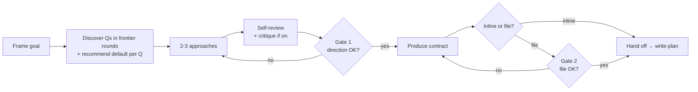

# Write Spec

Define-phase entry skill. Convert a vague request into a sharp spec the next phase can execute against. Discovery questions in frontier rounds, design alternatives, user approval, compact contract.

## Iron Rule

<EXTREMELY-IMPORTANT>
1. NEVER skip the spec when the goal, scope, or success criteria are ambiguous, or when the request touches a high-risk surface (auth, billing, payments, credits, migration, data deletion, secrets, tokens, crypto, permissions, security).
2. NEVER start implementation before the user approves the design direction (Gate 1).
3. ASK discovery questions in FRONTIER ROUNDS: each round carries every question whose prerequisites are already settled — a question depending on an answer still open this round waits for the next. RECOMMEND a default answer per question — user confirms or overrides. Facts are never questions: anything the codebase or docs can answer is researched, not asked.
4. NEVER ship a spec that contains placeholders, contradictions, or untested assumptions about the user's intent.
5. WHEN the spec is saved as a file, require a second approval on the written file itself (Gate 2) — verbal agreement and written file drift apart.
</EXTREMELY-IMPORTANT>

Fires on a COMMISSION, never on musing — the user exploring an idea ("what if we…", "would X be worth it?" in any language) gets a discussion, not a spec interview; the router offers the spec once when the idea firms up (using-rolepod, Commission vs conversation).

## When to use

- User asks for a feature with vague boundaries
- Multiple valid implementations exist and the choice changes the diff
- The request touches a high-risk surface
- The codebase has no existing pattern for this work
- The user said "build me X" without details

Skip when:
- The task is a one-line fix with an obvious diff
- The user has already supplied a written spec
- The user explicitly says "skip spec" or "just write the code"

## Boundary

Owns:
- WHAT / WHY / scope / non-goals / success criteria / risk surfaces / chosen direction / user approval.

Does not own:
- File-by-file implementation order.
- Agent file ownership.
- Exact test commands per task.
- Editing code.

Hand off:
- Approved spec → `write-plan`.
- If the user already supplied a complete spec → skip to `write-plan`.

## Inputs to gather

- Exact user request (literal quote)
- Repo state relevant to the request (existing patterns, prior decisions). Repeat feature: read the most recent `docs/rolepod/specs/<feature>-*.md` and treat its Desired behavior as a *hypothesis* for today's Current behavior — verify it against the code before trusting it, never re-derive prior state from a blank slate.
- Constraints the user has already stated (deadline, stack, no-touch zones)
- High-risk surfaces likely touched

## Workflow

### 1. Frame the goal

State the user goal in one sentence. State 2-3 likely constraints. Flag any high-risk surface up front. If the goal needs an "and" to be stated, the request may be several specs — see `references/scope-splitting.md` before continuing. If the slices cannot even be listed yet because unresolved decisions block the view, escalate one level: `references/chart-work.md` — chart the decisions first, spec each slice after.

### 2. Discovery dialogue

Model the open decisions as a tree — each answer unblocks the questions hanging off it. Ask in **rounds**: number every question on the current frontier (all questions whose prerequisites are settled) and present the round together; a question whose answer depends on one still open belongs to the next round, not this one. Each question must change the implementation if the answer changes — skip obvious ones. A long frontier is grouped by topic and asked in full, never trimmed for brevity. Use the native question UI when available; without one, render the round as numbered questions with lettered options, the recommended default marked, and accept compact answers — `1a 3c`, or `defaults` to take every recommendation; never force the user to type prose for a choice. Done when the frontier is empty and no scout is still out — nothing left silently assumed.

**Recommend a default per question.** State the simplest viable answer alongside the question — user confirms or overrides. Faster than open-ended and forces you to commit to a position you can defend.

If a question can be answered by reading the codebase, explore the codebase instead — never spend a user question on what you can verify yourself. While a round is out to the user, that wait is free wall-clock: dispatch a scout on the researchable unknowns in parallel — a running scout is itself an unsettled prerequisite, so only the questions downstream of it wait; by the time answers land, evidence has often closed the next round unasked.

**Visual companion for UI-shape questions.** If a question is about UI layout, flow, or visual hierarchy and `rolepod-uiproof` is installed, offer a browser mockup or reference screenshot via `/verify-ui` or `/visual-diff` before asking the text question. Visual answers beat text for visual decisions. Interaction-FEEL questions go one step further: a disposable single-file HTML demo (inline CSS/JS, mock data, opens without a server) on a throwaway `spike/` branch — the user clicks the options before answering. The decision + branch pointer land in the spec; the branch is NEVER merged — demo code is an answer, not a head start.

Unsure which questions actually change the implementation? See `references/question-bank.md` for question types and skip rules.

### 3. Present 2-3 approaches

When the design has meaningful options, lay out 2-3 viable approaches with tradeoffs (complexity, blast radius, reversibility, cost). Recommend one. The simplest viable approach wins by default.

**Record the pick as an ADR only when all three hold**: (1) hard to reverse — changing course later costs real work; (2) surprising without context — a future reader would ask "why this way?"; (3) a real trade-off — genuine alternatives existed and one was chosen for stated reasons. Any one missing → no ADR; the spec itself is the record. Save to `docs/adr/NNNN-<slug>.md` (context, decision, consequences — one page).

### 4. Self-review the draft

Scan for:
- Placeholders (`[[FILL: …]]`, `TODO`, `tbd`)
- Contradictions between sections
- Ambiguous wording ("maybe", "should", "if needed")
- A Success criterion with no "proven by" — pair each with the command / observation that will prove it, or it is not checkable
- Scope creep beyond the user request
- Over-engineering for hypothetical needs

### 4b. Cross-family critique — questions only, before Gate 1

Pool enabled (opt-in; off → skip silently) and the spec is R3+ / high-risk (or the user asks) → hand the draft **plus the Q&A ledger** to a cold reader from another family: `rolepod-cross-family --kind critique --brief spec-draft.md` returns ≤5 items ranked by implementation risk (`QUESTION` / `AMBIGUITY` / `MISSING`, or `NO FURTHER QUESTIONS`). Triage first — settle from the repo what you can — then ONE extra §2 round with the rest; one line under **Open questions**. Never blocks a spec. Protocol: `references/question-bank.md` §Cross-family critique.

### 5. Gate 1 — direction approval

Present the proposed direction (chosen approach + rationale). Wait for the user to accept, edit, or reject. Do not write the contract before Gate 1 passes.

### 6. Produce the contract

Fill `templates/spec-template.md` — every section resolved, no placeholders, no contradictions. Then run the **spec-lint** against the filled text — pipe it in directly in inline mode, or lint the saved file in file mode: `grep -niE '\[\[FILL:|TODO|TBD'` must print nothing; any printed line, or a grep error (unreadable path, bad pattern), is a lint failure, never a silent pass (a deterministic backstop to the step-4 self-review; it catches an unfilled `[[FILL: …]]` marker or a stray TODO/TBD, never legitimate angle brackets like `<h1>` or `List<T>`, and not vague wording).

- One-session work → inline the filled template in chat. **No Gate 2** — Gate 1 is the only approval. Default when unsure: one-session/inline, unless the user names a multi-day scope or the high-risk / repeat test below applies.
- Multi-session work, high-risk surface touched, or repeat feature → save to `docs/rolepod/specs/<feature>-YYYY-MM-DD.md` — **private by default:** before the first save run `grep -qx 'docs/rolepod/' .gitignore || echo 'docs/rolepod/' >> .gitignore` (the commit gate denies any commit that stages `docs/rolepod/`; a repo that deliberately tracks its specs creates `.rolepod/docs-tracked`) — (optional `-vN` or `-draft` suffix). Proceed to Gate 2.

### 7. Gate 2 — file review (file-mode only)

After saving, run the spec-lint (`grep -niE '\[\[FILL:|TODO|TBD'`) on the file — it must print nothing — then ask the user to read the file and confirm, not the chat transcript. Catches three drifts:
- **Word drift** — chat said "soft delete", file wrote "delete"
- **Implicit edge case** — user meant "except admin", file omits it
- **Reconsideration** — user sees concrete shape, changes mind

Patch the file and re-confirm if requested. Hand off to `write-plan` only after Gate 2 passes.

## If a matching Rolepod agent is available

Delegate discovery / drafting to the most appropriate specialist:

- `product-manager` for feature scope, user stories, success criteria
- `system-architect` for API / data-model / integration design
- `content-strategist` (`audience: dev`) for ADRs and durable spec artifacts
- `product-manager` (`mode: commercial`) for cost / ROI / commercial framing

Brief the agent with the user request, the discovery questions answered so far, and the approval gate the user expects.

## If no matching agent is available

Execute the discovery + design checklist directly as Lead. Use this minimum viable checklist:

1. Quote the user request literally
2. List goals and non-goals
3. Name the high-risk surfaces touched
4. Ask the smallest set of questions needed
5. Sketch 2-3 viable approaches with tradeoffs
6. Recommend one approach with rationale
7. Wait for Gate 1 (direction) before producing the contract
8. Apply §6's inline-vs-file rule, then the matching gate (Gate 1 only, or Gate 2 for file mode)

## Output

The spec template is the canonical artifact: `templates/spec-template.md`. Fill every section — it is the contract `write-plan` consumes. Do not restate the section list here; the template is the single source of the spec shape. Inline vs file and the matching gate: §6 owns that rule.

## Examples

Non-blocking — read only when the spec being drafted is unclear:
- `examples/spec-examples.md` — two good/bad scenario pairs (one high-risk, one not) with a "why good wins" table. Read the whole file; the contrast is the lesson.

## References

Load only when the task needs it:
- `references/question-bank.md` — discovery question types + skip rules, when unsure what to ask
- `references/scope-splitting.md` — when a request is too big for one spec

## Hard stops

- A round's answers did not close the ambiguity → name the one thing still unresolved and ask the user to choose between two concrete framings; still unresolved after that → stop and record what is needed to resume, never re-ask the same question in a new shape
- User declines to approve any approach → stop, report what is blocking
- A high-risk surface is touched without a security / migration / audit plan → stop; add that plan to the spec, or delegate to `security-engineer` / `system-architect`, before handing off to `write-plan`

## Full Rolepod enhancement

Full Rolepod improves this phase by adding router continuity into `write-plan`, specialist agents for deeper domain shaping, hooks that remind on high-risk surfaces, and a deterministic spec-lint backed by `tests/integration/cases/spec-lint.sh` — which proves the lint catches an unfilled `[[FILL: …]]` marker or TODO/TBD, does not false-positive on ordinary angle brackets (`<h1>`, `List<T>`), and passes a clean spec.

## Next phase

- If `write-plan` is available, continue there with the approved spec.
- If `write-plan` is not available, hand off using this Implementation Plan Outline: files to touch, ordered tasks, test plan, risks, done criteria.
