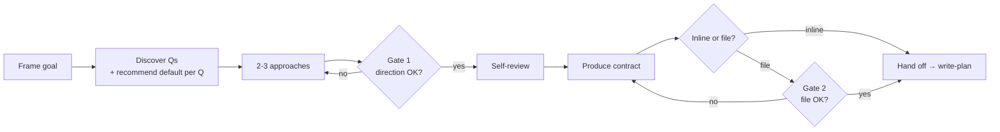

# Write Spec

Define-phase entry skill. Convert a vague request into a sharp spec the next phase can execute against. Discovery questions one at a time, design alternatives, user approval, compact contract.

## Iron Rule

<EXTREMELY-IMPORTANT>
1. NEVER skip the spec when the goal, scope, or success criteria are ambiguous, or when the request touches a high-risk surface (auth, billing, migration, data deletion, security).
2. NEVER start implementation before the user approves the design direction (Gate 1).
3. ASK one focused question at a time during discovery unless the user explicitly asks for a full questionnaire. RECOMMEND a default answer per question — user confirms or overrides.
4. NEVER ship a spec that contains placeholders, contradictions, or untested assumptions about the user's intent.
5. WHEN the spec is saved as a file, require a second approval on the written file itself (Gate 2) — verbal agreement and written file drift apart.
</EXTREMELY-IMPORTANT>

## When to use

- User asks for a feature with vague boundaries
- Multiple valid implementations exist and the choice changes the diff
- The request touches a high-risk surface
- The codebase has no existing pattern for this work
- The user said "build me X" without details

Skip when:
- The task is a one-line fix with an obvious diff
- The user has already supplied a written spec
- The user explicitly says "skip spec" or "just write the code"

## Boundary

Owns:
- WHAT / WHY / scope / non-goals / success criteria / risk surfaces / chosen direction / user approval.

Does not own:
- File-by-file implementation order.
- Agent file ownership.
- Exact test commands per task.
- Editing code.

Hand off:
- Approved spec → `write-plan`.
- If the user already supplied a complete spec → skip to `write-plan`.

## Inputs to gather

- Exact user request (literal quote)
- Repo state relevant to the request (existing patterns, prior decisions)
- Constraints the user has already stated (deadline, stack, no-touch zones)
- High-risk surfaces likely touched

## Workflow

### 1. Frame the goal

State the user goal in one sentence. State 2-3 likely constraints. Flag any high-risk surface up front. If the goal needs an "and" to be stated, the request may be several specs — see `references/scope-splitting.md` before continuing.

### 2. Discovery dialogue

Ask up to 5 targeted questions, one at a time. Each question must change the implementation if the answer changes. Skip obvious questions. Use the native question UI when available; otherwise plain-text prompts.

**Recommend a default per question.** State the simplest viable answer alongside the question — user confirms or overrides. Faster than open-ended and forces you to commit to a position you can defend.

If a question can be answered by reading the codebase, explore the codebase instead — never spend a user question on what you can verify yourself. Walk the decision tree by dependency: resolve the question that gates the others first, since its answer changes which downstream questions still matter.

**Visual companion for UI-shape questions.** If a question is about UI layout, flow, or visual hierarchy and `rolepod-uiproof` is installed, offer a browser mockup or reference screenshot via `/verify-ui` or `/visual-diff` before asking the text question. Visual answers beat text for visual decisions.

Unsure which questions actually change the implementation? See `references/question-bank.md` for question types and skip rules.

### 3. Present 2-3 approaches

When the design has meaningful options, lay out 2-3 viable approaches with tradeoffs (complexity, blast radius, reversibility, cost). Recommend one. The simplest viable approach wins by default.

### 4. Self-review the draft

Scan for:
- Placeholders (`TODO`, `<...>`, `tbd`)
- Contradictions between sections
- Ambiguous wording ("maybe", "should", "if needed")
- Scope creep beyond the user request
- Over-engineering for hypothetical needs

### 5. Gate 1 — direction approval

Present the proposed direction (chosen approach + rationale). Wait for the user to accept, edit, or reject. Do not write the contract before Gate 1 passes.

### 6. Produce the contract

Fill `templates/spec-template.md` — every section resolved, no placeholders, no contradictions.

- One-session work → inline the filled template in chat. **No Gate 2** — Gate 1 is the only approval.
- Multi-session work, high-risk surface touched, or repeat feature → save to `docs/rolepod/specs/<feature>-YYYY-MM-DD.md` (optional `-vN` or `-draft` suffix). Proceed to Gate 2.

### 7. Gate 2 — file review (file-mode only)

After saving, ask the user to read the file and confirm — not the chat transcript. Catches three drifts:
- **Word drift** — chat said "soft delete", file wrote "delete"
- **Implicit edge case** — user meant "except admin", file omits it
- **Reconsideration** — user sees concrete shape, changes mind

Patch the file and re-confirm if requested. Hand off to `write-plan` only after Gate 2 passes.

## If a matching Rolepod agent is available

Delegate discovery / drafting to the most appropriate specialist:

- `product-manager` for feature scope, user stories, success criteria
- `system-architect` for API / data-model / integration design
- `content-strategist` (`audience: dev`) for ADRs and durable spec artifacts
- `business-analyst` for cost / ROI / commercial framing

Brief the agent with the user request, the discovery questions answered so far, and the approval gate the user expects.

## If no matching agent is available

Execute the discovery + design checklist directly as Lead. Use this minimum viable checklist:

1. Quote the user request literally
2. List goals and non-goals
3. Name the high-risk surfaces touched
4. Ask the smallest set of questions needed
5. Sketch 2-3 viable approaches with tradeoffs
6. Recommend one approach with rationale
7. Wait for Gate 1 (direction) before producing the contract
8. Save inline for one-session work, or `docs/rolepod/specs/<feature>-YYYY-MM-DD.md` for multi-session / high-risk / repeat features — then require Gate 2 (file review)

## Output

The spec template is the canonical artifact: `templates/spec-template.md`. Fill every section — it is the contract `write-plan` consumes. Do not restate the section list here; the template is the single source of the spec shape.

For one-session work, inline the filled template in chat (Gate 1 only). For repeat, multi-session, or high-risk features, save it to `docs/rolepod/specs/<feature>-YYYY-MM-DD.md` and require Gate 2 (file review) before handoff.

## Examples

Non-blocking — read only when the spec being drafted is unclear:
- `examples/spec-examples.md` — two good/bad scenario pairs (one high-risk, one not) with a "why good wins" table. Read the whole file; the contrast is the lesson.

## References

Load only when the task needs it:
- `references/question-bank.md` — discovery question types + skip rules, when unsure what to ask
- `references/scope-splitting.md` — when a request is too big for one spec

## Hard stops

- Goal still ambiguous after 5 questions → ask the user to choose between two concrete framings
- User declines to approve any approach → stop, report what is blocking
- A high-risk surface is touched without a security / migration / audit plan → stop; add that plan to the spec, or delegate to `security-engineer` / `system-architect`, before handing off to `write-plan`

## Full Rolepod enhancement

Full Rolepod improves this phase by adding router continuity into `write-plan`, specialist agents for deeper domain shaping, hooks that remind on high-risk surfaces, and tests that prove the spec did not leak placeholders.

## Next phase

- If `write-plan` is available, continue there with the approved spec.
- If `write-plan` is not available, hand off using this Implementation Plan Outline: files to touch, ordered tasks, test plan, risks, done criteria.
